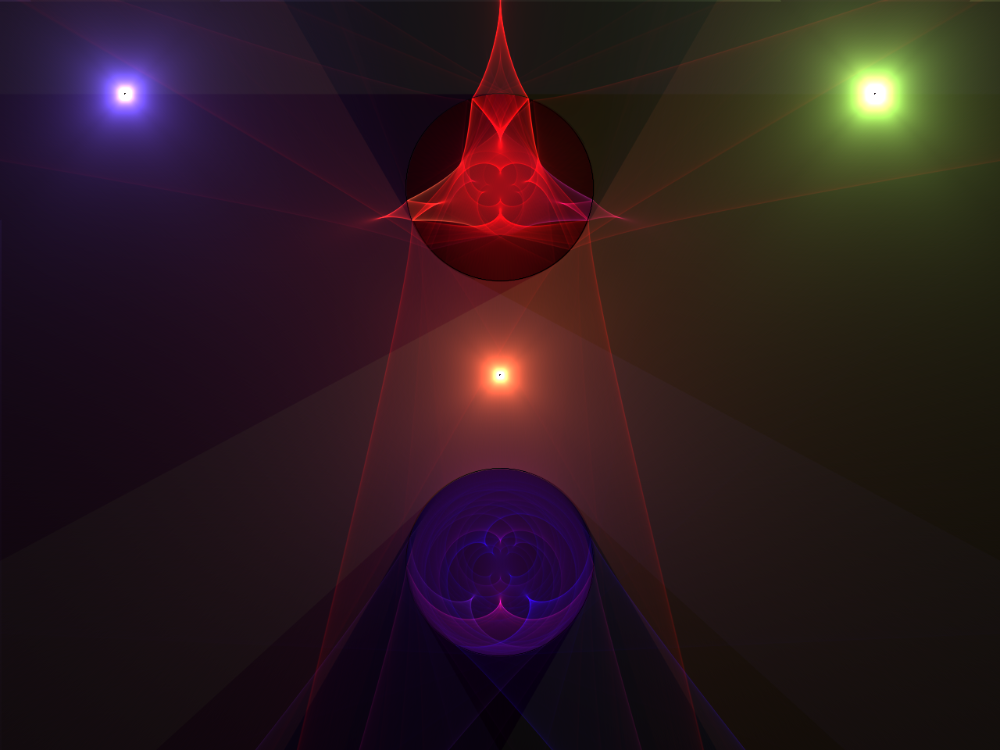

## rayn2d

A 2d raymarched 'light field visualizer' written in Rust. This is a physically based ray marcher disguised as a creative coding playground! More docs and examples coming soon. For now, feel free to look around and play, it should be relatively self explanatory for those of you that have played around with ray marchers before.

